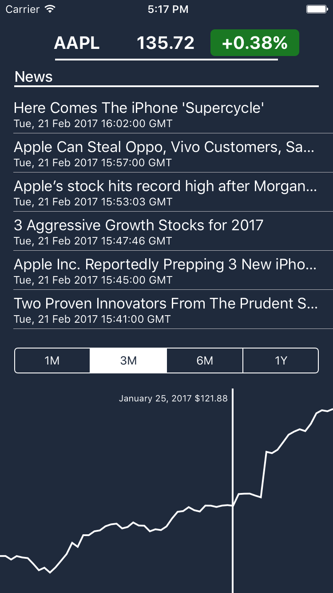

```

    /*
       It has come to our attention that this service is being
       used in violation of the Yahoo Terms of Service.
       As such, the service is being discontinued.
       For all future markets and equities data research,
       please refer to http://finance.yahoo.com.
    */
    
```

The app is still functional but needs new financial data sources

# Stocks App for iOS

Example App to view stock market data.
Using YQL to read from Yahoo's financial feeds to retrieve financial data, fetching with NSURLSessionDataTask and then using CoreGraphics and simple math to draw a graph.

Example Application for MVC Design-Pattern, talking to APIs and building custom UI elements.


